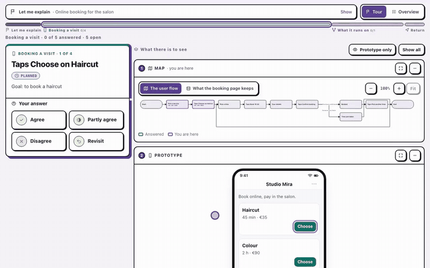
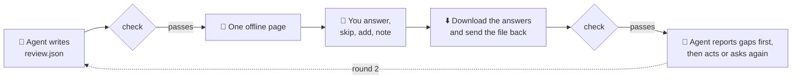
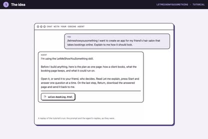
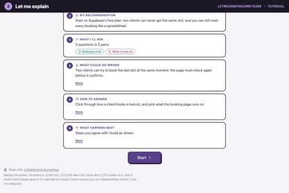
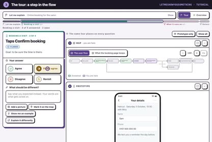
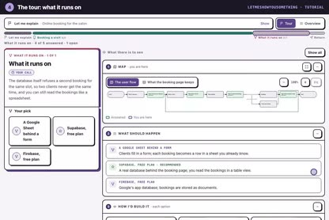
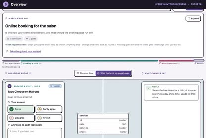
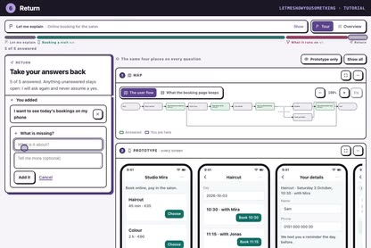
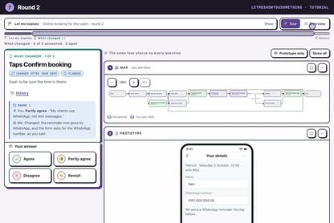

<div align="center">

<picture>
  <source media="(prefers-color-scheme: dark)" srcset="site/logo-dark.svg">
  
</picture>

# Let me show you something

**Your AI agent writes down what it needs you to judge, you answer on one offline page,<br>
and your answers go back to the agent as a file it checks before it acts.**

Any agent, any reviewer: no account, no install, no network. The answer is data, not a chat paragraph.

[](https://github.com/shyhunter/LetMeShowYouSomething/actions/workflows/check.yml)
[](LICENSING.md)
[](package.json)

[**Tutorial**](https://shyhunter.github.io/LetMeShowYouSomething/tutorial.html) ·
[**Try an example**](https://shyhunter.github.io/LetMeShowYouSomething/) ·
[**Wiki**](docs/wiki/README.md) ·
[**FAQ**](docs/wiki/faq.md)

<br>

<a href="https://shyhunter.github.io/LetMeShowYouSomething/tutorial.html#flow"></a>

</div>

## Contents

- [How it works](#how-it-works)
- [Install](#install)
- [The basic workflow](#the-basic-workflow)
- [What it can ask](#what-it-can-ask)
- [What's inside](#whats-inside)
- [What it does not do](#what-it-does-not-do)
- [Philosophy](#philosophy)
- [Contributing](#contributing) · [Licence](#licence)

## How it works

You ask your agent for something that needs your judgement: an app idea, a plan, test results, a choice between
options. Instead of a wall of chat, it writes the questions down as a review, checks them, and hands you **one HTML
page**.

You open it, read **Let me explain**, press **Start** and answer one question at a time, with the screens, the map and
what should happen right beside each question. Skip what you can't judge yet, add what nobody asked about, then
download your answers and send that one file back.

The agent reads the file, checks it adds up, and reports **gaps first**. What is still open comes back as round 2,
with what changed after your notes shown before and after.



## Install

It is an agent skill: a folder with instructions (`SKILL.md`), a renderer and a checker. It needs Node.js and nothing
else.

**Any agent that reads skills** (Claude Code, Codex, Hermes and others), through the
[skills](https://github.com/vercel-labs/skills) installer (Node.js 22.20 or newer):

```bash
npx skills add shyhunter/LetMeShowYouSomething -g
```

**Claude Code, by hand:** copy this folder to `~/.claude/skills/letmeshowyousomething/`.

**Hermes, by hand:** copy this folder to `~/.hermes/skills/letmeshowyousomething/`.

Then ask, for example:

> `/letmeshowyousomething` I want to create an app for my friend's hair salon that takes bookings online. Explain to me
> how it should look.

## The basic workflow

1. **You ask.** Anything with five or more things to judge, something to look at, or a reviewer outside the chat.
   One to four quick questions stay in chat.
2. **The agent writes a review and checks it.** Plain words, the right answer words for the job, screens drawn for an
   app idea, every code reference proven.
3. **It hands you one page.** No JSON, no summary in chat.
4. **You answer** in the tour or the Overview, with notes, pictures and marks on the map, and ask back with **Show me
   an example** or **Explain it differently**.
5. **You send one file back**: the answered page (HTML) or its JSON.
6. **The agent checks it and reports**: gaps first, then your requests, your choices, what you added, and the rest.
7. **Round 2** carries everything still open, and the page shows every round.

A verdict is never permission: before anything irreversible, the agent still asks you in its own tool.

## What it can ask

Each page below is the real thing: open it, press **Start**, answer, and download your answers on the last step.

| If you ask your agent … | You get | Try it |
|---|---|---|
| "I want an app for my friend's hair salon that takes bookings online. Explain how it should look." | An app idea: screens, what it stores, what it runs on | [Salon booking](https://shyhunter.github.io/LetMeShowYouSomething/examples/salon-booking.html) · [round 2](https://shyhunter.github.io/LetMeShowYouSomething/examples/salon-booking-round2.html) |
| "Show me how booking and cancelling would work, step by step, before you build it." | A user flow to click through, with a diagram | [Booking flow](https://shyhunter.github.io/LetMeShowYouSomething/examples/flow-booking.html) |
| "Should our search results be cards, a list or a table? Show me each." | Mockups side by side, picked from their own screen | [Results layout](https://shyhunter.github.io/LetMeShowYouSomething/examples/results-layout.html) |
| "Where should the answers be stored? Give me the options and your recommendation." | A decision, with the agent's doubts to judge | [Decision](https://shyhunter.github.io/LetMeShowYouSomething/examples/decision-review.html) |
| "I tested the new checkout. Give me the test cases so I can tell you which work." | Test results: works, partially, doesn't, couldn't test | [Checkout](https://shyhunter.github.io/LetMeShowYouSomething/examples/checkout-uat.html) |
| "Explain how resetting a password works in our app, on its real screens." | Screenshots of the running app, with the spot to tap | [Password reset](https://shyhunter.github.io/LetMeShowYouSomething/examples/password-reset.html) |

**See it from start to finish:** the [tutorial](https://shyhunter.github.io/LetMeShowYouSomething/tutorial.html), 7 short videos.

| | | | |
|:-:|:-:|:-:|:-:|
| [](https://shyhunter.github.io/LetMeShowYouSomething/tutorial.html#idea)<br>**1** The idea | [](https://shyhunter.github.io/LetMeShowYouSomething/tutorial.html#explain)<br>**2** Let me explain | [](https://shyhunter.github.io/LetMeShowYouSomething/tutorial.html#flow)<br>**3** A step in the flow | [](https://shyhunter.github.io/LetMeShowYouSomething/tutorial.html#choice)<br>**4** What it runs on |
| [](https://shyhunter.github.io/LetMeShowYouSomething/tutorial.html#overview)<br>**5** Overview | [](https://shyhunter.github.io/LetMeShowYouSomething/tutorial.html#return)<br>**6** Return | [](https://shyhunter.github.io/LetMeShowYouSomething/tutorial.html#round2)<br>**7** Round 2 | |

## What's inside

| Part | What it does | Read more |
|---|---|---|
| `SKILL.md` | Tells the agent when to use it, how to write a review, and how to report what comes back | [With your agent](docs/wiki/with-your-agent.md) |
| `review.json` | What the agent asks: items, answer words, choices, approvals, diagrams, a flow of screens | [The review](docs/wiki/the-review.md) |
| `bin/render.mjs` | Turns a review into one offline page: Let me explain, the tour, Overview, Return | [The page](docs/wiki/the-page.md) |
| `feedback.json` | What comes back: every answer, note, picture and added item, readable without the page | [The answers](docs/wiki/the-answers.md) |
| `bin/check.mjs` | Proves a review or an answer is complete and honest, in seven modes | [The checker](docs/wiki/the-checker.md) |
| `bin/init.mjs`, `answer.mjs`, `usage.mjs`, `pictures.mjs` | Start right, read a returned page safely, report cost honestly, look at pictures | [The other tools](docs/wiki/the-tools.md) |
| [`PROTOCOL.md`](PROTOCOL.md), [`schemas/`](schemas) | The format, so any agent, script or tool can write the question or read the answer | [PROTOCOL.md](PROTOCOL.md) |

## What it does not do

- **Quick questions.** One to four simple questions are faster in chat; when their answers must be kept, the agent
  reads them back and records them as the same checked file.
- **Prove who answered.** The files are unsigned. Trust comes from how the file travels: your repo, your email, your
  ticket system.
- **Scan for every kind of sensitive data.** The checker refuses keys, tokens and passwords in URLs; keep customer data
  out of a review, because it gets forwarded.
- **Promise every agent.** Any agent that can write files and run Node can use it; it has been run with Claude Code,
  Codex and Hermes, and the recorded conformance runs ([conformance/RESULTS.md](conformance/RESULTS.md)) cover Claude
  Code.

## Philosophy

- **The answer is data.** Every item gets an answer; an unanswered one is written down as unanswered, never left out.
- **Gaps first.** What needs work or has no answer yet comes before everything else.
- **The reviewer needs nothing** but a browser, and can add what nobody asked about.
- **Nothing is taken on trust.** The checker recomputes the totals; the agent never acts on a file that fails.
- **A protocol, not a product.** The page is one way to show a review; a terminal, an app or a printed sheet are just as
  valid, as long as what comes back passes the checker.

## Contributing

```bash
node --test test/protocol.test.mjs          # the protocol, the checker, the renderer
npm ci && npx playwright install chromium firefox webkit
npx playwright test                         # the pages in three browsers, at desktop, tablet and phone size
```

Playwright is a test-only dependency; the skill itself needs none. [CONTRIBUTING.md](CONTRIBUTING.md) has the house
rules. Which file owns which part: [docs/ARCHITECTURE.md](docs/ARCHITECTURE.md).

## Licence

Free and complete, with no paid version. Three licences, depending on where a file ends up
([LICENSING.md](LICENSING.md)):

- **Apache-2.0**: the checker, the renderer, the skill and the tests.
- **MIT-0**: the code copied into every page you send, and the examples. A page you send carries no obligation.
- **CC0-1.0**: the protocol and its schemas. Implement the format anywhere.
