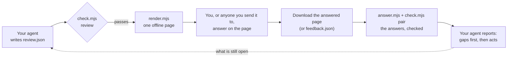

# LetMeShowYouSomething: the wiki

How the skill works, part by part, and what each part is for. For the exact rules, [PROTOCOL.md](../../PROTOCOL.md)
is the authority; this wiki explains them in plain words.

## The round trip

Your agent needs your judgement on several things at once. Instead of a long chat, it writes them down, turns them
into one page, and reads your answers back as data it checks before it acts.

## The parts

| Part | What it is | Why it matters |
|---|---|---|
| [The review](the-review.md) | `review.json`: what the agent asks, and everything you need to judge it | One question per thing to judge, written once, at the right level |
| [The page](the-page.md) | `render.mjs` turns the review into one HTML file | Nothing to install, no account, no network: anyone can answer |
| [The answers](the-answers.md) | `feedback.json`: every answer, note, picture and added item | Readable by any agent, script or person, without the page |
| [The checker](the-checker.md) | `check.mjs`: proves a review or an answer is complete and honest | The agent never acts on an answer that doesn't add up |
| [The other tools](the-tools.md) | `init.mjs`, `answer.mjs`, `usage.mjs`, `pictures.mjs` | Start right, read answers safely, report cost honestly |
| [With your agent](with-your-agent.md) | What SKILL.md tells the agent to do, step by step | The same loop in Claude Code, Codex, Hermes or any agent that runs Node |
| [FAQ](faq.md) | The questions people ask first | |

## Where to start

- **See it:** the [tutorial](https://shyhunter.github.io/LetMeShowYouSomething/tutorial.html), 7 short videos from an
  app idea to round 2.
- **Try it:** the example pages on the [project site](https://shyhunter.github.io/LetMeShowYouSomething/) are the real thing.
- **Install it:** `npx skills add shyhunter/LetMeShowYouSomething -g`, then ask your agent for a review.
